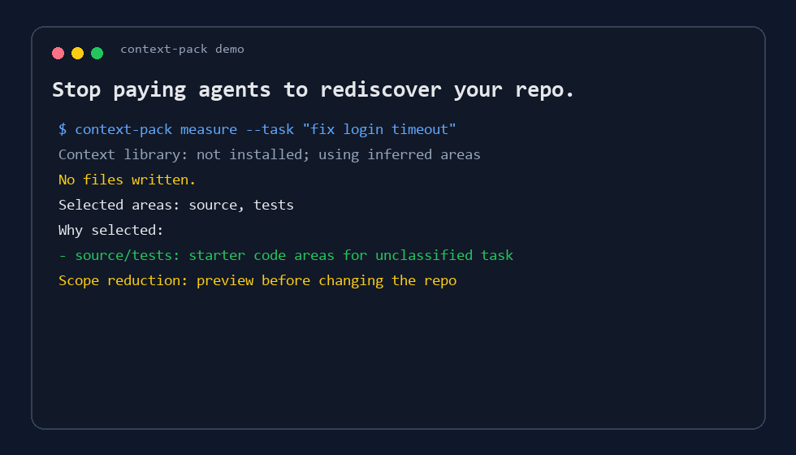

# Context Pack

<p align="center">
  <strong>Version-aware context packs for Codex, Claude, Cursor, and coding agents.</strong>
</p>

<p align="center">
  <a href="https://github.com/Fharena/context-pack/actions/workflows/ci.yml"></a>
  <a href="https://github.com/Fharena/context-pack/releases/tag/v0.1.5"></a>
  <a href="LICENSE"></a>
  
</p>

<p align="center">
  <a href="README.ko.md">한국어</a> ·
  <a href="#install">Install</a> ·
  <a href="#terminal-demo">Terminal Demo</a> ·
  <a href="#how-it-works">How It Works</a>
</p>

<p align="center">
  
</p>

Stop paying agents to rediscover your repo.

Context Pack keeps a small repo-local project library, checkpoints git state, and generates compact task-specific reading packs before an agent reads broadly. It is markdown-first, git-aware, stale-aware, and intentionally light: deterministic script first, semantic agent judgment second.

This gets more useful as coding agents move across local IDEs, cloud worktrees, hosted app sessions, and remote machines. When the workspace changes, the repo should carry the map.

## Who It Is For

Use Context Pack when you:

- move work between Codex, Claude, Cursor, cloud worktrees, local IDEs, or remote machines
- review branches where an agent should start from the risky files instead of the whole repo
- maintain a project where future AI contributors need a small, current map
- want markdown context that travels with git instead of living inside one vendor's memory system

Skip it for tiny throwaway repos, one-off prompts, or projects where a single short `AGENTS.md` is already enough.

## Why

Most AI coding waste starts before coding. The agent has to rediscover which files matter, which tests cover the change, which contracts must not break, and whether old notes are stale.

Context Pack turns that repeated search into a small project library:

- `.codex/context/` is the project index.
- `.codex/handoff/` is the current work state.
- `.codex/packs/CONTEXT_PACK.md` is the generated desk for the current task.

## Built For Multi-Session Agent Work

Modern agent work is no longer one local chat attached to one checkout. You might start in a local IDE, ask Codex to work in the app, run a cloud task, review from another machine, or hand a branch to a different agent.

Context Pack makes the repo carry enough context for that handoff:

- Which checkout and git state was last checkpointed
- Which areas own the changed files
- Which contracts and tests matter for review
- Which notes may be stale and need source verification
- Which generated/local files should not be trusted or committed

## Install

Recommended for Codex:

```bash
pipx run --spec git+https://github.com/Fharena/context-pack.git context-pack install-codex --activate
```

If the Codex CLI is not on `PATH`, omit `--activate` and run the printed `codex plugin add ...` command later.

Then talk to your agent:

```text
Use $context-pack to initialize this repo.
Use $context-pack to start work on this bug.
Use $context-pack to checkpoint this work.
```

The agent runs the engine, reads the generated pack, and continues from the focused context. In a context-enabled repo, the skill is also designed for proactive use: an agent should run `context-pack start` before broad reading, review, unfamiliar debugging, or handoff even when you did not name the tool.

If you already installed the CLI, update or install the Codex plugin with:

```bash
context-pack install-codex --activate
```

For non-Codex agents or direct terminal use:

```bash
pipx install git+https://github.com/Fharena/context-pack.git
context-pack start
context-pack start --task "fix login timeout"
context-pack start --review --base main
```

## Local Install Options

Install from a clone as a local Codex plugin:

```powershell
python plugins/context-pack/scripts/context_pack.py install-codex --force --activate
```

Install only the skill:

```powershell
python scripts/install_skill.py
```

Run from source without installing anything:

```powershell
python plugins/context-pack/scripts/context_pack.py init
python plugins/context-pack/scripts/context_pack.py start --review --base main
```

This repository also includes a repo-scoped Codex marketplace:

```text
.agents/plugins/marketplace.json
```

After cloning, you can add this repo as a local Codex plugin marketplace so Codex can discover the bundled plugin from the repo:

```bash
codex plugin marketplace add .
codex plugin add context-pack@context-pack
```

## Terminal Demo

```text
$ context-pack start --task "improve CLI onboarding" --max-areas 3 --max-read-first 8
Context Pack Start for /work/context-pack
Git: yes; branch: main; HEAD: 67f7355488c0
Context library: ok
Dirty files: 0; diff hash: clean

Generated work pack for task: .codex/packs/CONTEXT_PACK.md
Selected areas: installer-release, skill-plugin, engine

Read next:
- .codex/packs/CONTEXT_PACK.md
- .codex/context/AREAS/installer-release.md
- .codex/context/AREAS/skill-plugin.md
- .codex/context/AREAS/engine.md

$ Get-Content .codex/packs/CONTEXT_PACK.md -TotalCount 40
# Context Pack

Mode: work

## Selected Areas
- installer-release (score 68): changed files matched: CHANGELOG.md, README.ko.md, README.md (+5 more)
- skill-plugin (score 40): changed files matched: plugins/context-pack/.codex-plugin/plugin.json, plugins/context-pack/skills/context-pack/SKILL.md, plugins/context-pack/skills/context-pack/agents/openai.yaml (+1 more); task matched keywords: agent
- engine (score 34): changed files matched: plugins/context-pack/skills/context-pack/scripts/context_pack.py, src/context_pack/__init__.py, src/context_pack/bundled/context_pack.py (+1 more)

## Related Areas
- tests (score 14): changed files matched: plugins/context-pack/skills/context-pack/scripts/context_pack.py, tests/test_context_pack.py

## Read First
- .codex/context/AREAS/installer-release.md
- README.md
- README.ko.md
- CHANGELOG.md
- pyproject.toml

## Read Later
- .codex/context/AREAS/skill-plugin.md
- plugins/context-pack/skills/context-pack/SKILL.md
- .codex/context/AREAS/engine.md

## Contracts To Check
- The engine must remain stdlib-only so it can run from a skill, plugin, or copied checkout.
- ... more contract(s) omitted; inspect area docs if needed
```

The point is not to replace source code. The point is to make the agent start from the right shelf.

## What It Does

| Feature | What it saves |
| --- | --- |
| `start` | One-command first step: auto-init if needed and prepare a task, review, or changed-files pack |
| `install-codex` | Installs the Codex plugin and personal marketplace entry from a package or clone |
| `init` | Creates a repo-local context library, handoff docs, and inferred source/test/doc areas |
| `status` | Shows context health, likely areas, stale warnings, and next action |
| `checkpoint` | Records branch, HEAD, dirty files, and diff hash to ignored local state by default |
| `pack` | Builds a compact task-specific reading pack with selected and related areas |
| `review-pack` | Builds a compact code-review pack from dirty files or `--base` |
| `mark-reviewed` | Marks verified area docs reviewed at the current HEAD |
| `doctor` | Checks whether the context library is usable |
| `install-git-hooks` | Adds opt-in repo-local checkpoint automation |

## Agent-First UX

Tell the agent:

```text
Use $context-pack to initialize this repo.
Use $context-pack to make a context pack for this bug.
Use $context-pack to review this branch against main.
Use $context-pack to checkpoint this work.
Initialize context-pack in this repo.
Build a review context pack for my changes.
Checkpoint this work for the next session.
```

The more important path is implicit:

- before broad repo reading: run `context-pack start --task "..."`
- before review: run `context-pack start --review --base <base-ref>` when a base is known
- during unfamiliar debugging: generate a task pack before opening many files
- after meaningful edits or review notes: run `checkpoint --pack` so the local agent state is resumable without dirtying git
- when a handoff should travel through git: run `checkpoint --publish --pack`
- after verifying changed source against area docs: run `mark-reviewed <area>` to close stale warnings

After initialization, agents should read:

1. `.codex/handoff/CURRENT.md`
2. `.codex/context/INDEX.md`
3. `.codex/packs/CONTEXT_PACK.md` when generated
4. Relevant `.codex/context/AREAS/*.md`
5. Actual source files

## Why Not Just AGENTS.md Or CLAUDE.md?

Use those files. Context Pack is not a replacement.

`AGENTS.md`, `CLAUDE.md`, `.cursor/rules`, and similar files are durable instruction layers: coding style, commands, policies, and project rules. Context Pack is the routing layer beside them:

- It snapshots branch, HEAD, dirty files, and diff hash.
- It maps changed files or a task prompt to the relevant area docs.
- It generates a temporary read-first pack for the current task or review.
- It warns when summaries may be stale.
- It keeps generated/local context out of git while tracking durable project memory.

So the agent reads the rule file for behavior, then reads Context Pack for where to look first.

## How It Works

Context Pack is not a vector database and not a generic memory bank. It is a version-aware routing layer.

The script handles deterministic work:

- git branch, HEAD, dirty files, diff hash
- Codex plugin installation from an installed package or source checkout
- one-command `start` routing for first-run init, task packs, review packs, and dirty-file packs
- first-run inference for common source, test, docs, and automation areas
- changed-file and task scoring for area matching
- compact context pack assembly with primary and related areas
- Read First / Read Later splitting
- contract and failure-mode deduplication
- stale warnings
- context health status and reviewed-state updates
- generated file cleanup
- optional git hook installation

The agent can then improve semantic context over time:

- area summaries
- project contracts
- common failure modes
- durable decisions

You do not need to hand-write a full taxonomy to start. `init` creates useful defaults from the files already in the repo; semantic refinement is the compounding layer.

## Git Policy

Track:

- `.codex/context/manifest.json`
- `.codex/context/INDEX.md`
- `.codex/context/REVIEW.md`
- `.codex/context/CONTRACTS.md`
- `.codex/context/AREAS/*.md`
- `.codex/handoff/CURRENT.md`
- `.codex/handoff/LOG.md`
- `.codex/handoff/DECISIONS.md`

Ignore:

- `.codex/packs/`
- `.codex/context/tmp/`
- `.codex/handoff/LOCAL.md`

Automatic agent checkpoints write to `.codex/handoff/LOCAL.md` and `.codex/packs/` by default, so normal end-of-work checkpointing should not dirty tracked files. Use `context-pack checkpoint --publish --pack` when the handoff itself is part of the work you want to commit.

## Automation

Optional safe git hooks. You do not need this to use Context Pack.

The primary automation model is agent behavior: the installed skill and repo `AGENTS.md` tell agents to use Context Pack proactively at task, review, debugging, and handoff boundaries. `checkpoint` writes ignored local state by default, so agents can use it at the end of a work unit without dirtying tracked handoff docs. Git hooks are only a mechanical backup for git boundaries such as checkout, merge, and commit.

```powershell
context-pack install-git-hooks --mode safe
```

Safe mode installs:

- `pre-commit`: run `doctor`
- `post-checkout`: checkpoint after branch changes
- `post-merge`: checkpoint after pulls/merges

Aggressive mode also checkpoints after commits:

```powershell
context-pack install-git-hooks --mode aggressive
```

Remove hook blocks:

```powershell
context-pack uninstall-git-hooks
```

## Development

Run tests:

```powershell
python -m unittest discover -s tests -v
```

Validate public metadata and CLI packaging:

```powershell
python -m json.tool plugins/context-pack/.codex-plugin/plugin.json
python -m json.tool .agents/plugins/marketplace.json
python -m pip install -e .
context-pack --help
```

GitHub Actions runs stdlib unit tests and JSON validation on Windows and Ubuntu for Python 3.11 and 3.12.

## Release

See [CHANGELOG.md](CHANGELOG.md). Current release: [v0.1.5](https://github.com/Fharena/context-pack/releases/tag/v0.1.5).
